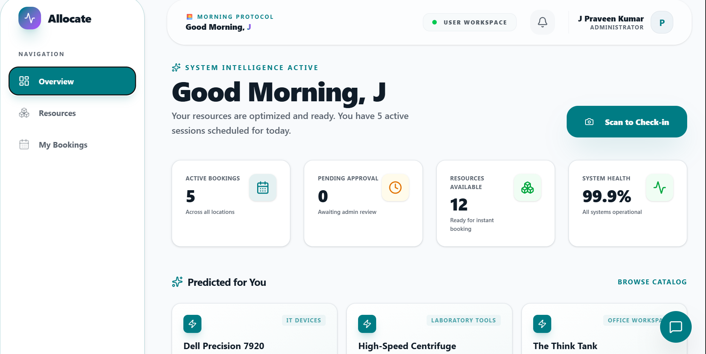
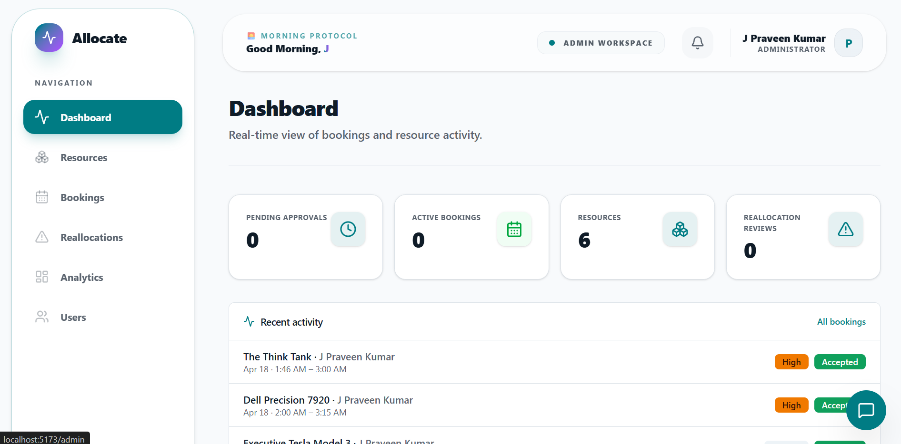
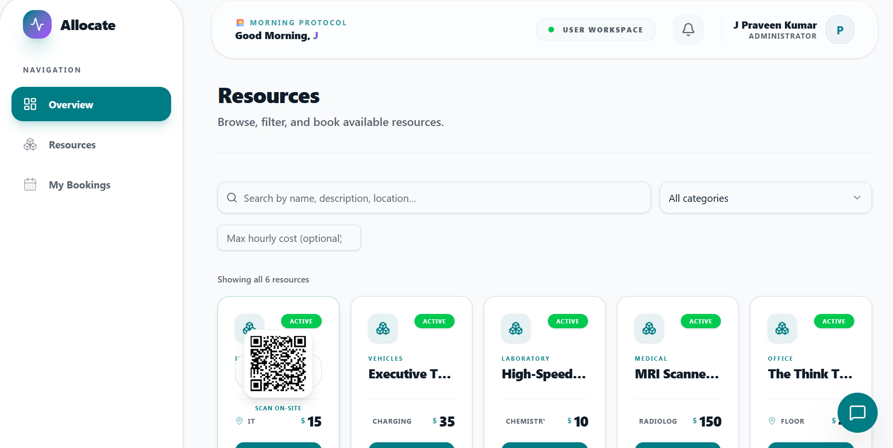
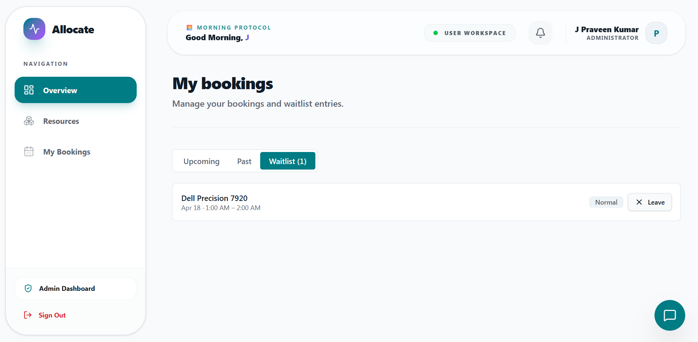

# 🚀 Resource Navigator — Classic Amazing Edition

**High-Performance Resource Allocation & Intelligent Booking Engine**

Built for efficiency, transparency, and speed. Resource Navigator is a premium workspace management platform designed to handle mission-critical resource allocation using intelligent priority-based logic and real-time neural assistance.

## 🖼️ Platform Demo Link



**https://allocate-voidx.vercel.app**

*The high-density "Classic Amazing" dashboard featuring personalized greetings and real-time utilization stats.*

---

## 💎 Key Features

### 🧠 Neural AI Assistant
- **Natural Language Booking**: Simply type "Book a lab for tomorrow at 3 PM" and the assistant handles the logic.
- **Voice-Enabled Commands**: Hands-free navigation and information retrieval using integrated browser speech recognition.
- **Contextual Knowledge**: Instant answers regarding resource locations, availability, and system stats.

### ⚡ Intelligent Reallocation Engine

- **Priority Override**: High-priority or Emergency requests can trigger reallocation suggestions for existing bookings.
- **Automated Conflict Detection**: The system identifies overlaps and suggests the most efficient way to resolve them.
- **Admin Review Workflow**: Admins can approve displacements with a single click, triggering instant notifications to affected users.

### 🔍 Global Resource Discovery

- **High-Density Grid**: A compressed, glassmorphic view for managing large catalogs with zero lag.
- **Multi-Layer Filtering**: Filter by category, price point, availability, and real-time status.
- **Smart QR Check-ins**: Generate and scan on-site QR codes for instant booking validation.

### 📅 Seamless Booking Management

- **Real-Time Scheduling**: Manage your active sessions, past history, and waitlist status in one unified view.
- **Waitlist Logic**: Automatically get notified when high-demand resources become available.

### 🛡️ Dynamic Priority & Safety
- **Neural Priority Engine**: Automatically calculates the urgency of a booking based on user intent and resource scarcity.
- **Automated No-Show Cleanup**: System-wide watchdog that cancels abandoned bookings to maximize resource utilization.
- **Fair-Use Governance**: Per-user weekly caps and automated time-blocks to ensure equitable access for all team members.

### 📊 Admin Command Center
- **Enterprise Analytics**: Real-time tracking of peak usage hours, system health, and utilization rates.
- **Role-Based Governance**: Secure management of users, administrative promotions, and resource constraints.
- **Live System Health**: Monitoring service uptime and database synchronization status.

## 🛠️ Technology Stack

- **Frontend**: React 19, TypeScript, TanStack Router, TanStack Query.
- **Styling**: Tailwind CSS with custom "Classic Amazing" enterprise tokens.
- **Backend/Database**: Supabase (PostgreSQL, Realtime, Auth, Storage).
- **Icons/UI**: Lucide React, Shadcn/UI (Radix primitives).
- **Utilities**: Date-fns for complex scheduling logic.

## 🚀 Getting Started

### 1. Prerequisites
- Node.js (Latest LTS)
- Supabase Project URL & Anonymous Key

### 2. Installation
```bash
npm install
```

### 3. Environment Setup
Create a `.env` file in the root:
```env
VITE_SUPABASE_URL=your_project_url
VITE_SUPABASE_ANON_KEY=your_anon_key
```

### 4. Running the Platform
```bash
npm run dev
```

## 🏗️ Architecture & Database

The system uses a robust PostgreSQL schema with advanced RLS (Row Level Security) policies:
- `resources`: The core catalog of labs, equipment, and rooms.
- `user_roles`: Role management (Admin/User).
- `bookings`: Real-time scheduling with priority markers.
- `notifications`: Live system alerts and reallocation triggers.

---

### 🏆 Hackathon Submission
🎯 **Developed for Aethornix 2026 Hackathon**
